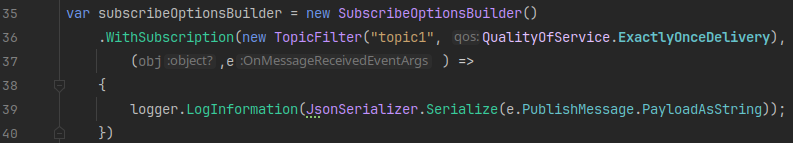

*Today is dedicated exclusively to combining IoT + Fullstack. Those who do not take IoT may skip this one unless you happen to be interested by chance. Today is especially relevant for those making exam project where you will use both subjets.*

**Remote repo for today's lesson: `https://github.com/uldahlalex/fs25_13_1`**


# Topics
- MQTT in .NET
- HiveMQ .NET client
- Subscriptions handlers and using a "dumb publisher" from C#
- How to debug & toubleshoot in multi-component systems in general & getting help during exam period when you're making multi-course project.


# Exercises

## Connect an .NET MQTT Client to your broker + Subscribe

This exercise may be completed in a completely new .NET project with no other code.

**Task: Subscribe to 2 different topics and log the message when received.** 

I recommend using the SubscribeOptionsBuilder:


Don't forget to add the Nuget to your .csproj. *Can be added with CLI like this:*

```bash
# don't forget to be in the folder with the .csproj file!
dotnet add package HiveMQtt 
```

Documentation can be found in README.md here: `https://github.com/hivemq/hivemq-mqtt-client-dotnet`.

Solution example can be found in today's repo directory "Exercise 1".

## Subscribe to data from an IoT device + save in database

Just like before - except now you need a DB connection from your C# application. When you get an MQTT message from the broker, save the data in the database from C#.

*Tip: Make sure to actively use the Dependency Injection system; Add services to the builder.Services and resolve these (like a DbContext / etc).*

## Publish to other MQTT clients when a Web client (admin) sends an HTTP request to the C# app

Now a browser/other HTTP client should be able to send HTTP request to your C# app and then the C# app should publish MQTT message to other MQTT clients *(example: Adjusting IoT device preferences from an admin panel).*

## Putting it all together

Now you must:

Subscribe to a topic in your C# backend -> Save the data to DB when it arrives -> Broadcast the data to appropriate web clients in real-time using the ConnectionManager.

I recommend making the final exercise (putting it all together) in a solution where you already have all the required boilerplate *(like the template_onion repository)*

The fullstack2025 repository does use all steps from this exercise. (But can of course be achieved with much less code)